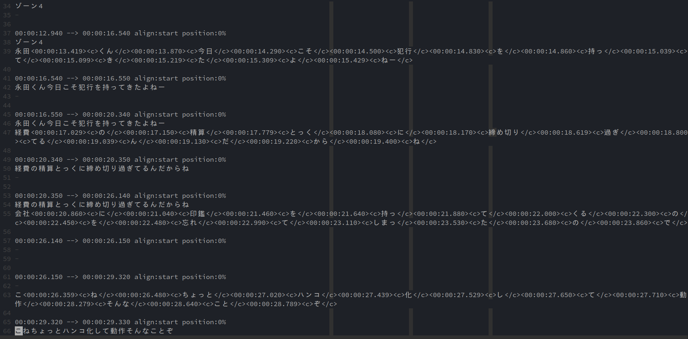
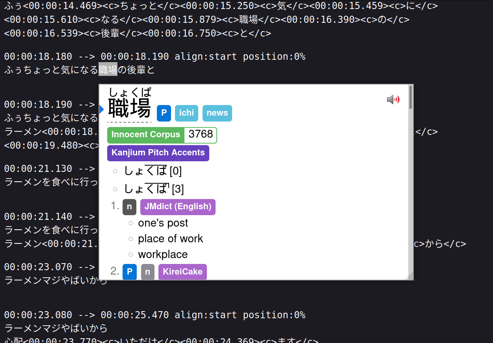

+++
date = "2022-02-19"
title = "downloading subtitles from youtube to help studying japanese"
categories = ["blog", "technical", "japanese", "quality of life"]
+++

# intro
As you may know, I've been studying Japanese for a while. 
It's a super difficult language for us European language speakers. There's the alphabets (3!) to learn,
the grammar, vocabulary etc.

Right now I am at a point where I don't have to look up every single vocabulary and have some basic grasp of grammar.
I haven't taken the official test but I am pretty sure I can pass the JLPT N5 test.
For all practical purposes, I am as a fluent as a 3 years old native Japanese child.

As I am studying just for fun, ie there's no real rush on learning the language (as opposed to someone that's going to live there, or work in a Japanese-speaking environment), I tend to slack a bit.

During my learning journey, I've came across the [AJATT method](http://www.alljapaneseallthetime.com/blog/), [MIA (now called Refold)](https://refold.la/mia/) and other methods. Their point is to immerse as much as possible in the target language, by (preferably) consuming media in the native language, since it's the most fun.

One thing I do in my Japanese classes is to watch comedy skits.
I like comedy because a) it's fun b) it shows a bit of the culture and c) doesn't require super an advanced vocabulary.

My favourite is the さんま御殿(Sanma Goten). They even upload their episodes on [YouTube](https://www.youtube.com/playlist?list=PLo7nw2x6bhE_0muc7m2pQzKqgmt8w2dG8).

So at class we go over 1 or 2 skits, for most skits I tend to understand almost everything, except the punch.
Luckily my teacher is there to explain the cultural nuances, the slang and whatnot.

Then later I review the episode, the grammar, vocabulary and sometimes create anki cards for them.

But sometimes I simply can't understand what they are saying. Or I can understand, but can't find in the dictionary,
which is pretty annoying.

Recently I came up with a strategy to deal with that: use youtube auto-generated subtitles to guide me through dialogue.
Instead of trying to type out weird vocabulary in the dictionary, I can simply copy paste the word from the subtitle.

# meat

For that we need to download the subtitle, surprisingly (or not) [youtube-dl](https://youtube-dl.org/) supports it.

Given a video, for example this one

<iframe width="560" height="315" src="https://www.youtube.com/embed/mV6YqnJ3lcM" title="YouTube video player" frameborder="0" allow="accelerometer; autoplay; clipboard-write; encrypted-media; gyroscope; picture-in-picture" allowfullscreen></iframe>

It's just a matter of calling

```sh
youtube-dl \
  --write-sub \
  --sub-lang=ja \
  --write-auto-sub \
  --skip-download \
  "https://www.youtube.com/watch?v=mV6YqnJ3lcM"
```

Which creates a file
```
[youtube] VvxK9uVOons: Downloading webpage
[info] Writing video subtitles to: 自分の食生活が異常だと気づいた瞬間【踊る!さんま御殿!!公式】-VvxK9uVOons.ja.vtt
```

The flags mostly self explain themselves, the only thing is that to figure out the available languages you first need to run `--list-subs`. For example:

```sh
youtube-dl --list-sub "https://www.youtube.com/watch?v=mV6YqnJ3lcM" | \
  awk '{ print $1 }' | tr '\n' ' '
```

Yields
```
[youtube] Available Language af sq am ar hy az bn eu be bs bg my ca ceb zh-Hans zh-Hant co hr cs da nl en eo et fil fi fr gl ka de el gu ht ha haw iw hi hmn hu is ig id ga it ja jv kn kk km rw ko ku ky lo la lv lt lb mk mg ms ml mt mi mr mn ne no ny or ps fa pl pt pa ro ru sm gd sr sn sd si sk sl so st es su sw sv tg ta tt te th tr tk uk ur ug uz vi cy fy xh yi yo zu VvxK9uVOons
```

Then I can just manipulate that subtitle file as normal:


Or better yet, opening in the browser and leveraging [yomichan](https://foosoft.net/projects/yomichan/)

