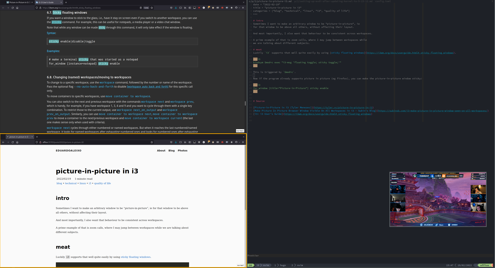

+++
date = "2022-02-19"
title = "picture-in-picture in i3"
categories = ["blog", "technical", "linux", "i3", "quality of life"]
+++

# intro
Sometimes I want to make an arbitrary window to be "picture-in-picture", ie
for that window to be above all others, without affecting their layout.

And most importantly, I also want that behaviour to be consistent across workspaces.

A prime example of that is zoom calls, where I may jump between workspaces while
we are talking about different subjects.

# meat
Luckily `i3` supports that well quite easily by using [sticky floating windows](https://i3wm.org/docs/userguide.html#_sticky_floating_windows).

```i3
bindsym $mod+c exec "i3-msg 'floating toggle; sticky toggle;'"
```

This is triggered by `$mod+c`.

Now if the program already supports picture in picture (eg firefox), you can make the picture-in-picture window sticky: 

```i3
for_window [title="Picture-in-Picture"] sticky enable
```


Here's an example me watching Rocket league while writing this post:


# source

[Picture-in-Picture in i3 (Tyler Menezes)](https://tyler.vc/picture-in-picture-in-i3)
[Make Picture In Picture Browser Window Visible On All Workspaces in i3 - Subin's Blog](https://subinsb.com/i3-make-picture-in-picture-window-seen-on-all-workspaces/)
[i3: i3 User’s Guide](https://i3wm.org/docs/userguide.html#_sticky_floating_windows)


