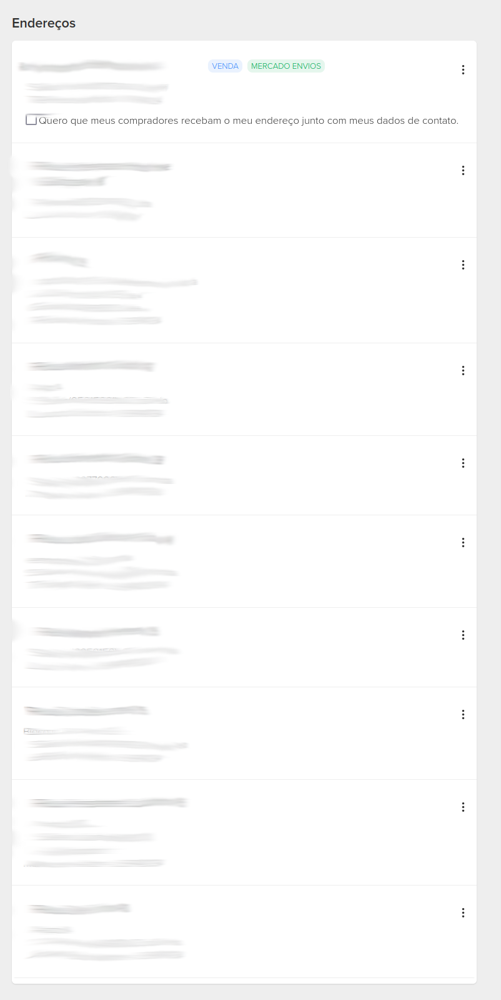
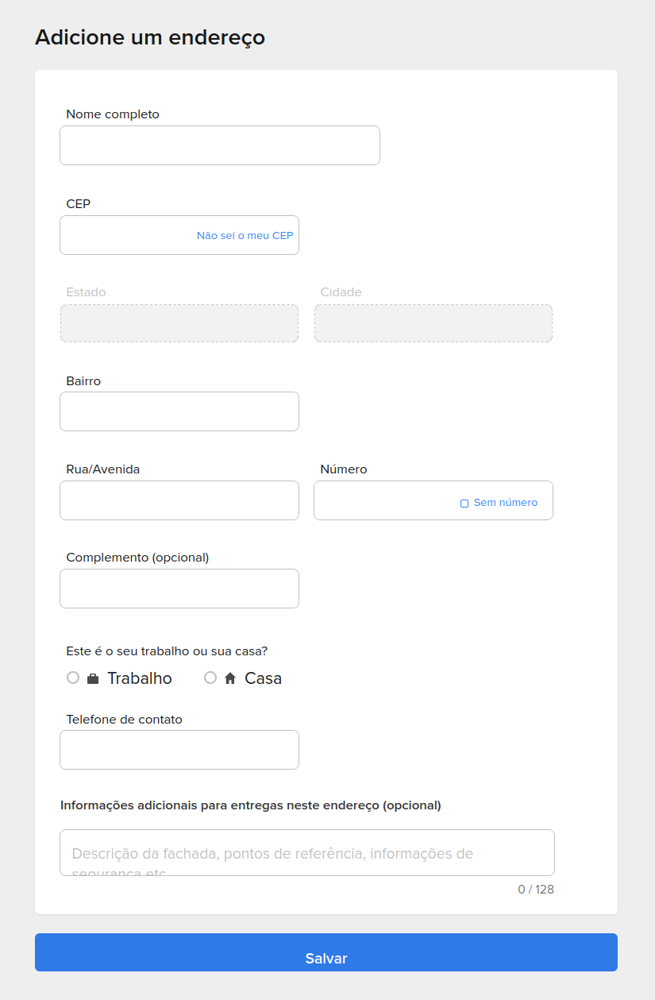
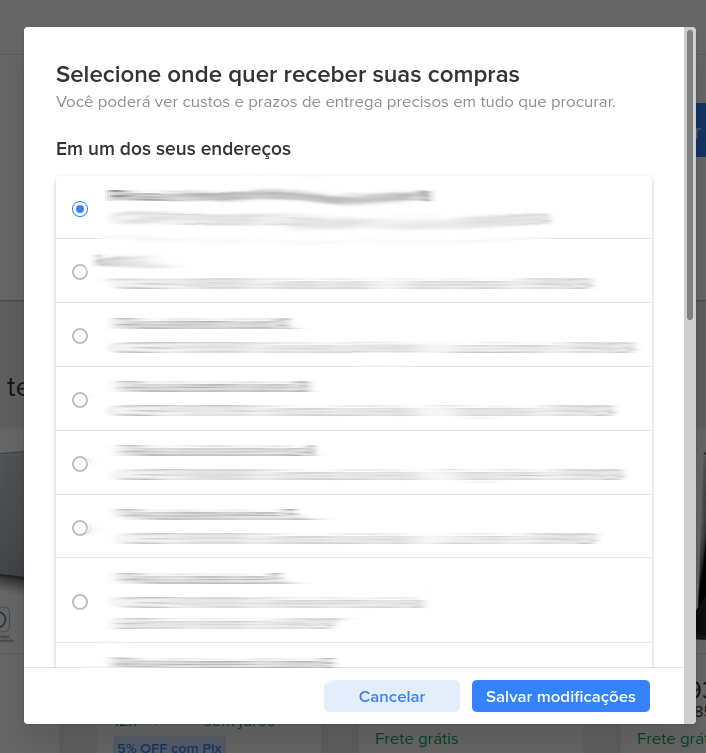

+++
date = "2021-11-30"
title = "Adding more addresses than allowed in MercadoLivre"
categories = ["life"]
+++

Lately I've been more empathic, affable, gentle etc. I don't know exactly why. Maybe it's because I am getting older. Maybe it's something else.

So for this year (2021) I decided to buy something to give to people I know. It doesn't have to be anything fancy so I decided to get them a chocotone, which is basically a panettone (Christmas bread) but with chocolate.

Since I am, first of all, a male, and second of all, lazy. I decided to skip the postcards and whatnot, and straight buying the chocotone online and putting people's addresses instead of my own.

I decided to use [MercadoLivre](wwww.mercadolivre.com), simply because I am used to that website and because their shipping is fast.

That worked well for the first 10 people. But then I noticed there's a limit on the number of addressed added:

Sure, I can just delete the other ones, right?

Yes, but that's not ideal, since I prefer to add ALL addresses and then just buy one by one.

Luckily I already had another tab open with the page to add an address. And guess what, it still works!

[https://www.mercadolivre.com.br/addresses/v2/address](https://www.mercadolivre.com.br/addresses/v2/address])

However it still doesn't show up in the list of added addresses. But it does show in the cart!

So it turns out that original limit is strictly a UI one. And luckily, there are 2 address picker components that don't share that same logic.

Once again, saved by companies' lack of cohesion!
