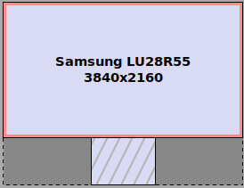

+++
date = "2021-04-04"
title = "my setup: ipad as a second monitor for quick note taking"
slug = "ipad-second-monitor-note-taking"
categories = ["blog", "technical", "ipad", "vimwiki", "vnc", "x11vnc"]
mermaid = true
+++

# the situation
* i have an old Ipad 2 (2011 model), stuck at 9.3.5 version. its screen is kinda broken, but still usable. almost no apps can be installed. it's slow.
* my window manager is [i3](https://i3wm.org/).
* i also started using vimwiki for note taking. i set it up as a [scratchpad](https://i3wm.org/docs/userguide.html#_scratchpad)\* to be able to take notes quickly.

\* in i3, a **scratchpad** it's simply a window that does not abide to the tiling rules. ie, a floating window on top of whatever is running. here's an example (it's already on the correct time mark):

<iframe width="560" height="315" src="https://www.youtube-nocookie.com/embed/OBlacr_XBjY?start=315" title="YouTube video player" frameborder="0" allow="accelerometer; autoplay; clipboard-write; encrypted-media; gyroscope; picture-in-picture" allowfullscreen></iframe>

just imagine that in my case it opens a vim instance instead of a terminal

# meh
the setup works, but i wasn't **fully satisfied**.

- there's still a context switch delay when opening up the scratchpad.

  i wanted the note taking to be right **in front of me at all times**. not only to take notes, but also to view them.

- it blocked my vision of what i was taking notes of

- sometimes, i wanted to take notes while sharing the main screen without anybody seeing them.

  i know, in zoom you can share a specific window, but i usually **share the whole screen** to have a more **personal connection**.

  for example, i hate when people are sharing a specific window, but then are interacting against a different window that's not shared.

yes i know, i could've just gotten a second monitor. but it's **too bulky**. i already ditched a two monitor setup in favour of a single one (yes it's a 4k one, but point still stands).

the idea? use the **ipad as a second monitor exclusively for note taking**!

# tldr
the final thing (don't mind the dust):


and a demonstration of how quick the workflow is


<video controls src="./cropped2.mp4"></video>


here's a break down of what's happening in the video:

| state        | explanation                             |
|--------------|-----------------------------------------|
| inital state | focused on firefox (see orange border)  |
| Super + u    | change focus to the ipad worskpace (i3) |
| i            | enter insert mode (vim)                 |
| hello world  | type "hello world" (vim)                |
| esc          | go to normal mode (vim)                 |
| Super + u    | focus back to firefox (i3)              |


alright, so how is the setup done?

# ipad as second monitor
first, how do i get an ipad to work as a second monitor?

if you are in the apple ecosystem, there are few solutions, including [an official one](https://support.apple.com/en-us/HT210380). not applicable to me for obvious reasons.

[as](https://kbumsik.io/using-ipad-as-a-2nd-monitor-on-linux) [many](https://medium.com/@bitsoftomorrow/share-your-linux-screen-over-ipad-for-free-77afbf267357) [others](https://old.reddit.com/r/unixporn/comments/8xzqz5/xpsipad_dual_screen_setup_with_x11vnc_ipad_and/), i resorted to a classic solution: **vnc**.


the idea is simple: create another display and use the ipad to display its contents (ie, as a vnc viewer).

# vnc
if you are not familiar, vnc stands for virtual network computing.
in a nutshell, it allows you to control and view a remote desktop.

it's based on the **rfb** (remote framebuffer) protocol, so for all effects in this post they are interchangeable.

it uses a client/server model. in a high level the server sends the framebuffer, and the (thin) client displays it.

# vnc tools
i tried to run [VirtScreen](https://github.com/kbumsik/VirtScreen), which is basically a layer on top of [x11vnc](https://linux.die.net/man/1/x11vnc). but it was crashing, and the ui was buggy.

based on their api i should be able to reproduce with **x11vnc** and plain **xrand** commands. oh, yeah, i forgot to mention, **this setup only works with x11 server** (ie no wayland).


# creating a virtual monitor
most tutorials assume you are able to create a **VIRTUAL display**. apparently [it's easier to do with you run an intel gpu](https://wiki.archlinux.org/index.php/Extreme_Multihead#Using_a_virtual_output), but in my case i run a nvidia gpu, so no luck here.

there were certain places suggesting to use a real device output, assuming you have one left (gpus usually have 2, 3 ports). in my case there are 2 non used ports: hdmi and dvi. apparently you have to trick the os to think these devices are turned on, with a [jumper](https://www.geeks3d.com/20091230/vga-hack-how-to-make-a-vga-dummy-plug/). liked the creativity but too hacky for my taste.

# evdi kernel module
thankfully, found a [stack overflow post](https://unix.stackexchange.com/questions/585069/unable-to-add-a-virtual-display-to-xorg/585078#585078) suggesting to run [displaylink](https://www.displaylink.com/)'s evdi kernel module to add a virtual output. that was mouthful.

unfortunately i couldn't install via my packet manager (dnf) neither building from source.
but they ship [rpm packages](https://github.com/displaylink-rpm/displaylink-rpm) for fedora/centos.

the downside here is that **i have to  wait for them to ship new versions every time i update my os**. which may be an issue.

another drawback i found is that certain applications can't find the virtual device, which is generally not a problem.

after activating the kernel module (see the stack overflow post on how to), `xrandr` shows another provider, indicating it works

```bash
> xrandr --listproviders

Providers: number : 2
Provider 0: id: 0x1b8 cap: 0x1, Source Output crtcs: 4 outputs:
         4 associated providers: 1 name:NVIDIA-0
Provider 1: id: 0x257 cap: 0x2, Sink Output crtcs: 1 outputs:
         1 associated providers: 1 name:modesetting
```

# adding the virtual display
to be able to use that new display, i need to add a new mode. for that, i used the `gtf` tool.


the ipad has a `1024x768` resolution, so:

```bash
$ gtf 1024 768 60

# 1024x768 @ 60.00 Hz (GTF) hsync: 47.70 kHz; pclk: 64.11 MHz
Modeline "1024x768_60.00"  64.11  1024 1080 1184 1344  768 769 772 795 \
  -HSync +Vsync
```

let's copy that and add to `xrandr`
```bash
xrandr --newmode "1024x768_60.00"  64.11  1024 1080 1184 1344  768 769 772 795  \
  -HSync +Vsync
```

then i add that mode to one of the unnused interfaces, in my case, evdi created a DVI one:


```bash
xrandr --addmode DVI-I-1-1 "1024x768_60.00"
```

then position that new screen. in my case, i wanted it to be below the primary one, centralized horizontally, like this:




the calculation is straightforward:

the primary monitor is `3840px` wide.
the ipad is `1024px` wide.

the center of the primary monitor is `3840/2` = `1920px`.
the center of the ipad is `1024/2` = `512px`.

so the ipad's X axis should start at
`1920 - 512 = 1408`

for the height, we want to position it immediately below the primary monitor,
therefore `2160` (the primary monitor's height).

therefore
```bash
xrandr --output DVI-I-1-1 --mode "1024x768_60.00" --pos 1408x2160
```

the sanity check:
```bash
> xrandr | grep -i -A 1 dvi-i
DVI-I-1-1 disconnected 1024x768+1408+2160
  (normal left inverted right x axis y axis) 0mm x 0mm
   1024x768_60.00  59.92*
```


# setting up vnc

as a simple test, let's run the vnc server. i chosen x11vnc since i want the ipad to be part of my current x session.

```bash
x11vnc -clip 1024x768+1408+2160
```

then in the ipad, i installed [realvnc client](https://apps.apple.com/us/app/vnc-viewer-remote-desktop/id352019548). why? because it was the only one available to download.

after setting up the vnc client, i was able to connect. so the idea works.

# improving the setup
now to get it more "prod ready" i wanted few things:

* use systemd
* nice integration with i3
* vnc auth
* graceful degradation
* restrict the ipad to access the internet


# systemd setup
i wanted to have a setup that's as hands free as possible. preferably, to only be triggered when the vnc client connects.

one way to do that is using [systemd socket activation](http://0pointer.de/blog/projects/socket-activated-containers.html).
the idea is simply to start the x11vnc server when the ipad tries to connect. additionally, running setup/teardown scripts.

first, a file `/etc/systemd/system/x11vncipad-proxy.socket`.
it basically sets up a socket listening on `0.0.0.0:5900` (ie all interfaces on port 5900).

```systemd
[Unit]
Description=VNC Socket for x11vnc + ipad

[Socket]
ListenStream=0.0.0.0:5900
SocketUser=eduardo

[Install]
WantedBy=sockets.target
```

when the socket activates, a service named `x11vncipad-proxy` is started. this is done by convention. ie, the service with same name but with a different suffix (`s/.socket/.service/`).


file `/etc/systemd/system/x11vncipad-proxy.service`.

```systemd
[Unit]
Requires=x11vncipad.service
After=x11vncipad.service

[Service]
ExecStart=/lib/systemd/systemd-socket-proxyd 127.0.0.1:15900 --exit-idle-time=5s
```
this service just starts a `systemd-socket-proxy`, which is exactly what the name says: a proxy for the socket. it forwards traffic to port `15900` on localhost. i did that based on this [stackoverflow post](https://superuser.com/questions/1129714/how-to-properly-start-x11vnc-through-systemd-socket-activation). theoretically since x11vnc supports `inetd`, the proxy is not needed, but i couldn't make it work.

notice how it `Requires` another service to be running (`x11vncipad`). that's the actual x11vnc service.

file `/etc/systemd/system/x11vncipad.service`.
```systemd
[Unit]
Description=x11vnc server

[Service]
User=eduardo
Type=simple
Environment="DISPLAY=:0"

ExecStartPre=/home/eduardo/bin/setup-ipad-vnc.sh
ExecStart=/usr/bin/x11vnc -nonap -repeat -clip 1024x768+1408+2160 -auth guess \
  -rfbport 15900 -usepw
ExecStartPost=/home/eduardo/bin/waitport.sh 127.0.0.1 15900
ExecStopPost=/home/eduardo/bin/teardown-ipad-vnc.sh
```
few things happening here:
* it runs as my own user. since socket activation requires root user
* the display is exported as an environment variable, since the unit does not inherit the window's env vars. of course, this doesn't work if i start the x server in another tty
* `ExecStartPre` and `ExecStopPost` are responsible for setup and teardown, will break it down later
* `ExecStartPost`, it waits for the port to be bound before signaling systemd that the service is good (since it takes few seconds for x11vnc to start)

now onto the x11vnc options:


| flag           | explanation                                                              |
|----------------|--------------------------------------------------------------------------|
| -nonap         | don't make it sleep, so that's always ready to receive focus             |
| -repeat        | allow repeating keystrokes. no idea why it's turned off                  |
| -clip          | only tunnel the 2nd monitor area                                         |
| -auth guess    | let x11vnc heuristic to authorize with x                                 |
| -rfbport 15900 | run on a different port (5900 which is already used)                     |
| -usepw         | use a password, it will ask you to generate one the first time           |


so the setup happen as follows (bear in mind this is not exactly the terminology systemd uses):


graph TD
    socket[x11vncipad-proxy.socket]-->|activates|proxy[x11vncipad-proxy.service]
    proxy[x11vncipad-proxy.socket]-->|starts|svc[x11vncipad.service]
    svc-->setup[setup-script.sh]
    setup-->x11vnc
    x11vnc-->|runs-after-starts|F[waitport.sh 15900]
    F-->|waits|F
    F-->|signals it's ready|E[systemd]
    E-->END( );



teardown:

graph TD
    socket[x11vncipad-proxy.socket]-->|deactivates|proxy[x11vncipad-proxy.service]
    proxy[x11vncipad-proxy.service]-->|stops|svc[x11vncipad.service]
    svc-->|stops|x11vnc
    x11vnc-->setup[teardown-script.sh]
    setup-->END( );


# i3 integration

before we dive into the scripts, i would like to explain another requirement: graceful degration. in this case, it simply means **if x11vnc is not running, still allow me to easily access the vimwiki.**


the flow can be summarized as:


graph TD
    A[user] -->|press $mod+u| B{is x11vnc running?}
    B -->|yes| D[focus on vimwiki workspace]
    B -->|no| E[focus on scratchpad]



ok, onto the scripts now. starting with the setup:

file `~/bin/setup-ipad-vnc.sh`

```bash
#!/usr/bin/env bash

set -euo pipefail

function main() {
  xrandr --newmode "1024x768_60.00" 63.50  1024 1072 1176 1328  \
  768 771 775 798 -hsync -vsync | true

  xrandr --addmode DVI-I-1-1 "1024x768_60.00" | true

  xrandr --output DVI-I-1-1 --mode "1024x768_60.00" --pos 1408x2160
}

# For some reason I have to run twice
main
main

i3-msg '[window_role="vimwiki"] move to workspace 11;'
i3-msg '[window_role="vimwiki"] floating disable;'
```

i added the modes (same as before). the only difference is the OR (||) with true. the idea is to never fail. this would be the default behaviour, but since i am using [strict mode](../bash-strict-mode) this is needed.

for some reason have to run the script twice. still haven't found out why. must be a race condition. it always is.

then the i3 bit. it moves the vimwiki window to workspace 11 (arbitrary number).
then i set up that workspace to only be displayed on my ipad (DVI-I-1-1).
file `~/.config/i3/conf`
```
workspace 11 output DVI-I-1-1'
```

also disable floating. which is turned on by scratchpad.


then the teardown:

```bash
#!/usr/bin/env bash

xrandr --output DVI-I-1-1 --off
i3-msg '[window_role="vimwiki"] move to scratchpad'
```

which is pretty simple. it just turns off the monitor and move the vimwiki window to the scratchpad.
we are just missing one last piece. to have `$mod+u` to always focus on vimwiki, whether x11vnc is setup or not (see flowchart above).

```bash
#!/usr/bin/env bash
set -euo pipefail

# is second monitor open?
if i3-msg -t get_outputs | jq --exit-status \
  '.[] | select(.name == "DVI-I-1-1").active == true' ; then
  # focus on that workspace
  i3-msg 'workspace number 11'
else
  # open scratchpad
  i3-msg '[window_role="vimwiki"] scratchpad show'
fi
```

script should be pretty clear. the only thing is using `jq` to find my virtual monitor.
if it's active then we focus on workspace 11, otherwise, show the scratchpad.

now the initial setup, when the computer starts. in that case, let's set up as a scratchpad. also, to open up vimwiki in a tmux session (i hope to create a different post to go over the vimwiki setup).

file `~/.config/i3/conf`

```bash
exec ~/bin/turn-off-ipad-vnc.sh

exec --no-startup-id terminator -r vimwiki -e \
  'tmux attach -t vimwiki || tmux new -s vimwiki "vim -c VimwikiMakeDiaryNote"'
```


also, one more neat feature is that pressing the same worskpace twice goes back to where you came from. 
ie, pressing `$mod + u` twice leave yous at the same place. that's done via:

```
workspace_auto_back_and_forth yes
```

why `$mod+u`? it's close enough to `hjkl` and it's not used.


and that should be it. whew.


# block ipad from external access
since the ipad should be used only locally, i added the following rule to the router (openwrt) to block external access:
```
iptables -I FORWARD -s 192.168.0.103 -d 0/0 -j DROP
```

btw, i left wireshark running for a while and found the ipad phones home from time to time. as expected.

# things i am not 100% happy with / other comments
* technically the connection is not encrypted, so somebody in the network could sniff the data.
  the suggestions are to run vnc over a ssh tunnel. but again, i am limited by my ipad's ability to download apps.

 * since my ipad model doesn't support ethernet, it suffers from [wireless problems](https://hpbn.co/wifi/#adapt-to-variable-latency)

 * we restrict vimwiki to run on the ipad, but we don't stop other applications from running on that workspace. i wish there was something like kubernetes taints, but couldn't find anything similar.

 * theoretically [novnc/noVNC](https://github.com/novnc/noVNC) could be used to run the vnc client in the browser, then the tls setup should be more straightforward

 * use ipset instead of hardcoding the ip in iptables

# parting thoughts
so far this solution has served me quite well. i strongly recommend as a way to save old tablets. it should work just fine with an android device, since all you need a vnc viewer.

# links
[kbumsik/VirtScreen: Make your iPad/tablet/computer into a secondary monitor on Linux.](https://github.com/kbumsik/VirtScreen)

[nvidia - Unable to add a VIRTUAL display to Xorg - Unix & Linux Stack Exchange](https://unix.stackexchange.com/questions/585069/unable-to-add-a-virtual-display-to-xorg/585078#585078)
[Extreme Multihead - ArchWiki](https://wiki.archlinux.org/index.php/Extreme_Multihead)

[How To Make a VGA Dummy Plug | Geeks3D](https://www.geeks3d.com/20091230/vga-hack-how-to-make-a-vga-dummy-plug/)

[i3 Config Tip: Assign Workspaces to Monitors | Destin Moulton](https://destinmoulton.com/blog/2019/i3-config-tip-assign-workspaces-to-monitors/)

[CERN Computer Security Information](https://security.web.cern.ch/recommendations/en/ssh_tunneling_vnc.shtml)
